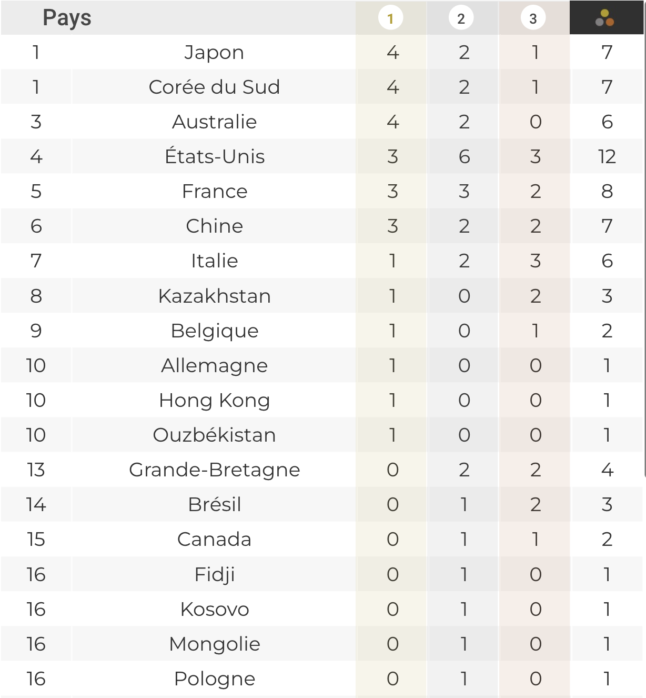
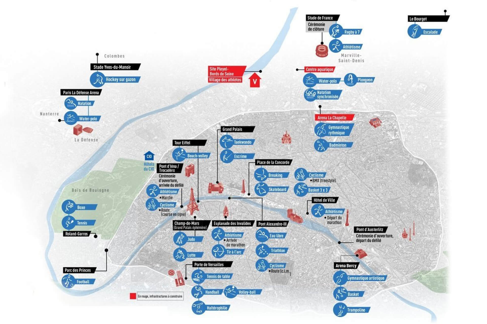
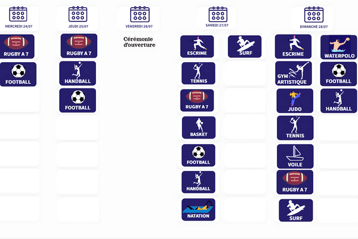
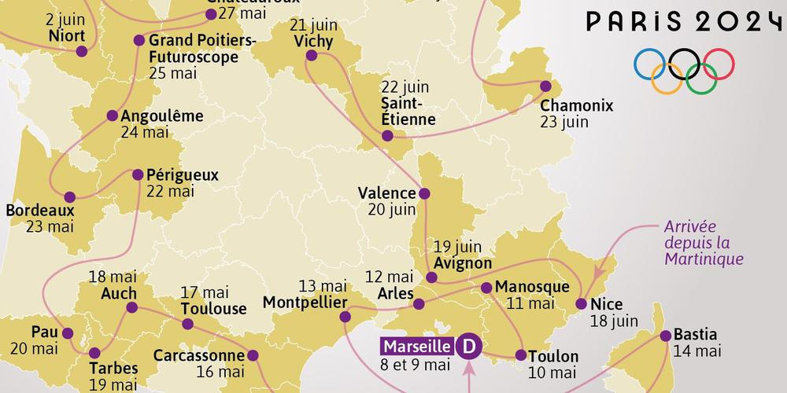

# INSA 4A Outils et méthodes de développement informatique
## Projet :
## Site Web Interactif pour les Jeux Olympiques de Paris 2024

  

Le Comité d'Organisation des Jeux Olympiques de Paris 2024 souhaite développer une plateforme web interactive pour les Jeux Olympiques de Paris 2024.  
Vous avez été mandatés pour développer cette plateforme fournissant des informations essentielles aux touristes et aux passionnés des Jeux Olympiques, améliorant ainsi leur expérience globale.

## Cahier des charges

### 1. Dashboard des Médailles
- Créer un tableau de bord récapitulatif des médailles par pays.
- Proposer des visualisations créatives (ex : carte interactive, graphiques dynamiques).  

### 2. Recherche d'Athlètes
- Implémenter un formulaire de recherche avancée permettant de filtrer les athlètes selon divers critères :
  - Nom
  - Nationalité
  - Discipline si disponible
- Afficher les médailles obtenues par l'athlète, le cas échéant.

### 3. Carte Interactive des Sites Olympiques
- Développer une carte interactive montrant tous les sites des compétitions.
- Permettre aux utilisateurs de cliquer sur chaque site pour voir :
  - Les épreuves qui s'y déroulent
  - Les horaires des compétitions
  - Les athlètes participants

### 4. Agenda Interactif des Épreuves
- Créer un calendrier dynamique des épreuves.
- Inclure des filtres par sport, date, et lieu.

### 5. Parcours de la Flamme Olympique
- Visualiser le trajet de la flamme olympique sur une carte interactive.

### 6. Guide Gastronomique
- Intégrer une fonctionnalité pour afficher les restaurants les plus proches des sites olympiques à Paris lorsqu'on les séléctionne.
- Utiliser le dataset des 200 meilleurs restaurants parisiens de TripAdvisor.

### 7. Système de FAQ Intelligent
Dans un second temps, le comité olympique vous demandera de développer un outil classification des questions fréquemment posées.  
Cet outil permettra de classer les questions en fonction de leur thématique dans l'objectif de faciliter la réponse aux utilisateurs en les redirigeant vers la bonne équipe de support.  
Vous allez pour cela utiliser le dataset disponible [ici](https://github.com/DavidBert/OMDI_JO2024/blob/main/questions_dataset/questions_train.csv) pour entraîner un modèle de machine learning.  
Je vous conseille d'utiliser une approche de type [TF-IDF](https://scikit-learn.org/1.5/modules/generated/sklearn.feature_extraction.text.TfidfVectorizer.html) avec un classifieur [random forest](https://scikit-learn.org/1.5/modules/generated/sklearn.ensemble.RandomForestClassifier.html) par exemple.  
Vous pouvez trouver un exemple de la démarche [ici](https://scikit-learn.org/1.5/auto_examples/text/plot_document_classification_20newsgroups.html#sphx-glr-auto-examples-text-plot-document-classification-20newsgroups-py) pour vous inspirer.  

Les livrables pour cette partie sont les suivants:  

- Une page sur le site web permettant de poser une question et qui renvoie un message de confirmation du type "Votre question a été reçue, elle sera traitée dans les plus bref délais par l'équipe responsable de [catgorie prédite par le modèle]"
- Une evaluation de la performance du modèle de machine learning sur [ce dataset de test](https://github.com/DavidBert/OMDI_JO2024/blob/main/questions_dataset/questions_test.csv).  
__Attenion: vous devez entrainer le modèle sur l'une de vos machines et le déployer sur le serveur INSA.  
Cela signifie que vous ne devez pas faire l'entrainement sur le serveur. Vous devez à la place entrainer en local et enregistrer le modèle (tfidf + random forest) dans un fichier ou plusieurs fichiers(.pkl) puis depuis le serveur charger le modèle et l'utiliser pour la classification des questions.__  

## Spécifications Techniques

### Données
Pour ce projet, le comité olympique vous conseille d'utiliser les datasets suivants:  
- [Dataset principal des Jeux Olympiques de Paris 2024](https://www.kaggle.com/datasets/piterfm/paris-2024-olympic-summer-games)  
- [Parcours de la flamme olympique](https://www.kaggle.com/datasets/piterfm/paris-2024-olympic-summer-games?select=torch_route.csv)  
- [200 meilleurs restaurants parisiens selon TripAdvisor](https://www.kaggle.com/datasets/kanchana1990/200-best-paris-eateries-tripadvisor-24)
- [Dataset des questions](https://github.com/DavidBert/OMDI_JO2024/blob/main/questions_dataset/questions_train.csv)

### Framework Web
Pas de contrainte particulière, vous pouvez utiliser le framework de votre choix.
Si vous souhaitez faire le projet en Python, le comité olympique vous conseille d'utiliser Flask comme framework web principal.
  - Flask est léger et flexible, idéal pour ce type de projet éducatif.
  - Il permet une intégration facile avec diverses bibliothèques de visualisation.

### Gestion des Données
Le comité olympique vous conseille d'utiliser python pour la manipulation et l'analyse des données CSV.
- Utiliser pandas pour la manipulation et l'analyse des données CSV.
  - Pandas est parfaitement adapté pour travailler avec des fichiers CSV fournis.
  - Il offre des fonctionnalités puissantes pour le filtrage, le tri et l'agrégation des données.

### Visualisation
- Employer Plotly pour créer des graphiques interactifs (ex : dashboard des médailles).
- Utiliser Folium pour les cartes interactives (parcours de la flamme olympique, sites des compétitions).

### Interface Utilisateur
La encore vous pouvez utiliser le framework de votre choix.  
Pour ceux qui souhaitent faire le projet en Python, le comité olympique vous conseille d'utiliser Streamlit pour le développement rapide de l'interface utilisateur.
  - Streamlit est particulièrement adapté pour créer des applications de data science interactives avec peu de code.
  - Il s'intègre bien avec pandas, Plotly et Folium.

### Machine Learning
- Utiliser scikit-learn pour les tâches de base en ML, comme la vectorisation de texte et les mesures de similarité.
- Employer des bibliothèques comme NLTK ou spaCy pour le traitement du langage naturel (NLP) nécessaire à la FAQ intelligente.

### Stockage de Données
- Stocker les données dans des fichiers CSV, conformément au format des datasets fournis.
- optionnel: Si nécessaire, utiliser SQLite pour une base de données légère, facile à mettre en place sans configuration serveur.

### DevOps
- Utiliser Git pour le contrôle de version.
- Mettre en place une pipeline CI/CD avec GitLab CI pour l'intégration et le déploiement continus.
- Implémenter des tests unitaires avec pytest.
- optionnel: Utiliser Docker pour la containerisation de l'application si nécessaire pour le déploiement.

### Gestion de Projet
- Utiliser Jira pour la gestion des tâches et le suivi de l'avancement.
- Mettre en place des sprints Agile de 2 semaines.
- Organiser des stand-ups quotidiens et des revues de sprint.

### Déploiement
- Utiliser les serveurs INSA pour le déploiement de l'application web.

## Livrables
1. Code source complet sur GitLab
2. Un site web hébergé sur les serveurs INSA
3. Documentation technique et guide utilisateur
4. Rapport de performance du modèle de ML pour la FAQ
5. Présentation finale du projet

